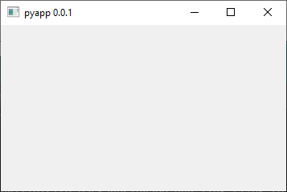

# pyapp 

An example GUI app in Python. It is using several tools for formatting/linting (`isort`, `black`, `flake8`, `mypy`). Unit testing is done through `pytest` with `coverage`. For CI [GitHub Actions](https://docs.github.com/en/actions) is employed.

## How to prepare dev environment on Windows

- Install [Python 3.8+](https://www.python.org/ftp/python/3.8.10/python-3.8) (e.g. to: `C:/Python38`). Do NOT use `python.exe` from [Anaconda](https://www.anaconda.com/products/individual).

- Clone this repo (`git clone https://github.com/tantecky/pyapp.git`).

- Run PowerShell commands in the repo directory:

```powershell
C:/Python38/python.exe -m venv venv
venv/Scripts/Activate.ps1
python.exe -m pip install --upgrade pip
python.exe -m pip install pyside6
python.exe setup.py develop
python.exe -m pip install -e .[dev]
```

- Open `workspace.code-workspace` in [VS Code](https://code.visualstudio.com/).

- If you add a new dependecy run:
  - `python.exe setup.py develop`
  - `python.exe -m pip install -e .[dev]`
  - `tox --recreate`

### Unit testing

- Run `tox` in the repo directory.

## Usage

- Run `pyapp` to start the program.

## Screenshots



